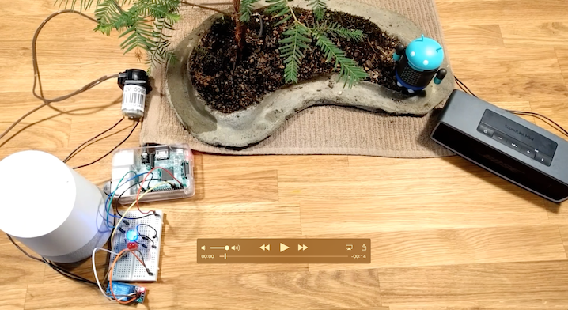

### Android Things & The Google Assistant

The attached project is a sample Android Things powered IoT device backed by the Google Assistant and controllable via Google Assistant Actions. The device will respond to the activation phrase of "hey CapTech Assistant" and be able to process requests to the Assistant. Any Assistant enabled device can request to speak to the IoT device by saying, "talk to CapTech Gardener." Via the assistant you can make requests like, "water my bonsai for 2 minutes" or "stop watering my plant." 

The device needs to follow the setup guideline from my previous blog found here. You will then need to create a [Firebase Project](https://firebase.google.com/) with the following JSON structure for the database. 

```json
{
  "bonsai_status" : {
    "some_id" : {
      "status_date" : 0,
      "watering" : false,
      "watering_duration" : 0
    }
  }
}

```

Next, create an [API.ai](https://console.api.ai/api-client/) project. Set up the Welcome, Watering, & Stop Watering intents as described in the attached blog. 

Create and deploy an API.AI fulfillment endpoint to Cloud Functions.

Download and install [node.js](https://nodejs.org/en/) and the [Firebase CLI](https://firebase.google.com/docs/cli/).
If you do not already have these installed, download and install node.js and the Firebase CLI. Once installed, you should be able to run them from your command line like this to check their versions:

```
node --version
```
```
firebase --version
```
In general, you should always make sure to keep the Firebase CLI up to date with the following command:

```
npm install -g firebase-tools
```

Create and initialize your Cloud Functions workspace
Now, create a folder to hold your project:

```
mkdir firebase-assistant-codelab
```

```
cd firebase-assistant-codelab
```

To authenticate and get access to your existing project:

```
firebase login
```

A window will appear requesting permissions. 

```
firebase init
```

You'll now have a "functions" directory ready to hold your code. There is a default index.js which is the entry point to your Cloud Functions code. Load it up in a code editor. You can overwrite the contents of this file by copying the [attached code](index.js) in its place. 


This function responds to HTTPS requests to a dedicated host for your project. You can see that work after you deploy the code.

This function also requires the Google Assistant node.js module, which needs to be installed into the project. Before deploying, you'll need up make sure the proper NPM modules are installed in the functions directory. Use npm to install the dependency in the functions/ directory:

```
cd functions
npm install --save actions-on-google
```


Deploy the Cloud Functions code
Every time you make changes to your functions, you will need to deploy that to the Google cloud with the following command:

```
firebase deploy
```

Use the generated URL in the webhook portions for your API.ai intents. 


### Required Hardware

- Raspberry Pi 3 device with Android Things flashed on it
- microphone, this project leverages this one from [Amazon](https://www.amazon.com/gp/product/B00IR8R7WQ/ref=oh_aui_detailpage_o06_s00?ie=UTF8&psc=1)
- A standard speaker with 3.5mm headphone jack
- 5v Relay [Amazon](https://www.amazon.com/gp/product/B00XT0OSUQ/ref=oh_aui_detailpage_o00_s00?ie=UTF8&psc=1)
- Peristaltic Pump [Amazon](https://www.amazon.com/gp/product/B00HIX2PEG/ref=oh_aui_detailpage_o01_s00?ie=UTF8&psc=1)


### Expected Wiring


### Demo
#### Start Watering
[](https://goo.gl/photos/FzQTve6USgGkdUre7)

#### Stop Watering

[](https://goo.gl/photos/ESCMXL1qWCe2vqabA)

### License

Licensed to the Apache Software Foundation (ASF) under one or more contributor license agreements. See the NOTICE file distributed with this work for additional information regarding copyright ownership. The ASF licenses this file to you under the Apache License, Version 2.0 (the "License"); you may not use this file except in compliance with the License. You may obtain a copy of the License at

[http://www.apache.org/licenses/LICENSE-2.0](http://www.apache.org/licenses/LICENSE-2.0)

Unless required by applicable law or agreed to in writing, software distributed under the License is distributed on an "AS IS" BASIS, WITHOUT WARRANTIES OR CONDITIONS OF ANY KIND, either express or implied. See the License for the specific language governing permissions and limitations under the License.